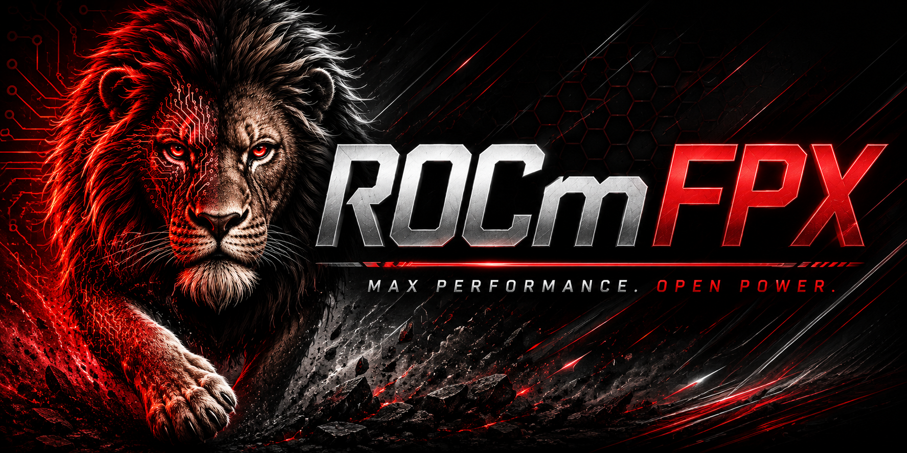

# Qwen3.8-27B for agents on a Radeon RX 7900 XT / XTX

This fork is an optimised runtime for **Qwen3.8-27B with 80k context on a 20 GB
RX 7900 XT** (more on the 24 GB XTX), tuned for **agentic work**: long tool-calling
sessions, several agents sharing one GPU, and clients that keep rewriting their
own history. It is [ROCmFPX](#rocmfpx-llamacpp) (ROCm/HIP, ROCmFP4 weights) plus a
server-side prompt cache on SSD that makes switching between conversations cost
seconds instead of minutes.

Everything below was measured on one machine: RX 7900 XT 20 GB, Ryzen 9 7900,
32 GB RAM, Windows 11, ROCm 7.2 HIP SDK, one NVMe for models and cache. The XTX
numbers are **not** measured - only the context headroom is extrapolated.

## Why a cache, and why this one

Qwen3.8 is a hybrid: 16 attention layers and 49 recurrent (gated delta-net)
layers. Recurrent state cannot be truncated, so the usual llama.cpp trick of
reusing the longest common prefix does not work - a prompt can only resume from
a saved **checkpoint** at or before the point where it diverges from what the
server holds. With one slot (20 GB leaves room for exactly one 80k context) and
several agents, that went badly. Over 9,600 real agent requests:

| where prefill time went | share |
|---|---|
| normal continuation of the conversation in the slot | 22% |
| returning to a conversation that had lost the slot: **full re-prefill** | **57%** |
| same conversation, but the agent rewrote earlier history: re-prefill | 14% |
| restored from cache | 6% |

A 50k-token conversation is ~110 s of prefill on this card. The changes in
this fork (all in `tools/server`) attack exactly that:

- **SSD prompt cache** (`--cache-disk`): a conversation that loses the slot is
  written to disk with its recurrent state and restored when it returns.
  Survives server restarts.
- **Every checkpoint is persisted**, not only the newest, so a returning prompt
  that diverges mid-history (compaction, pruned tool output, stripped reasoning)
  still resumes from the nearest earlier checkpoint.
- **Shared system-prompt entries** (`--cache-disk-prefix-step`): while the
  system prompt + tool definitions are prefilled the first time, the server
  saves exact states every 4096 tokens inside that block and at its end. Any
  later conversation that starts with the same tokens - a new session, a
  spawned worker, a compacted history - resumes from the deepest one it still
  shares. Entries are keyed by token content, so there is nothing to
  invalidate: a changed system prompt simply stops matching where it changed.
- **Pinned checkpoint** at the first user message, never evicted.
- **Checkpoint budget spread over the whole prompt**: when `--ctx-checkpoints`
  is full, the checkpoint whose removal leaves the smallest gap goes, instead
  of the oldest. Eight checkpoints then cover an entire 60k conversation rather
  than its last two requests.
- **Disk lookup on partial rewrites**, not only when more than half of the slot
  would be lost.
- **No junk** (`--cache-disk-min-tokens`): keep-alive pings and title requests
  are not written (each cost ~160 MB of fixed recurrent state).

Measured on the live server, same 49.6k-token conversation, 23.5k-token system
prompt + tools:

| situation | before | now |
|---|---|---|
| new session, same system prompt | 23.5k tokens, 50 s | **24 tokens, 0.8 s** |
| new session, system prompt differs near its end (date line) | 23.5k, 50 s | 3.1k, 8 s |
| another request takes the slot (save 49.6k) | 11 s | **1.7 s** |
| return to the 49.6k conversation | full re-prefill, 110 s | **27 tokens, 2 s** |
| agent rewrote mid-history, conversation still in slot | 49.6k, 110 s | 19.9k, 55 s |
| same, restored from SSD | 49.6k, 110 s | 13.4k, 39 s |
| server restart, 9.8k system prompt | 27 s | 15 tokens, 0.5 s |

## The recipe

**Model.** Qwen3.8-27B in ROCmFP4 (`MQ-Q4`, ~14.6 GB) with its MTP head, plus the
f16 `mmproj` for vision. We run a requant that promotes 61 sensitive tensors
(output, MTP projection, attention k/v/o on the full-attention layers, boundary
`ffn_down`) to `Q6_0_ROCMFPX`: wikitext-2 perplexity 7.107 vs 7.143 at the same
speed and VRAM.

**Build** (ROCm 7.2 clang, Ninja):

```
cmake -S . -B build-hip -G Ninja -DCMAKE_BUILD_TYPE=Release ^
  -DCMAKE_C_COMPILER="%HIP_PATH%bin\clang.exe" -DCMAKE_CXX_COMPILER="%HIP_PATH%bin\clang++.exe" ^
  -DCMAKE_PREFIX_PATH="%HIP_PATH%" -DGGML_HIP=ON -DGPU_TARGETS=gfx1100 -DCMAKE_HIP_ARCHITECTURES=gfx1100 ^
  -DGGML_HIP_GRAPHS=ON -DGGML_HIP_NO_VMM=ON -DGGML_HIP_FORCE_MMQ=ON -DGGML_CUDA_FA_ALL_QUANTS=ON ^
  -DGGML_CUDA_GRAPHS=ON -DGGML_NATIVE=ON -DGGML_OPENMP=ON -DGGML_SCHED_MAX_COPIES=4 ^
  -DLLAMA_BUILD_SERVER=ON -DLLAMA_BUILD_TOOLS=ON -DLLAMA_BUILD_TESTS=OFF -DLLAMA_CURL=OFF ^
  -DLLAMA_BUILD_WEBUI=OFF -DLLAMA_BUILD_UI=OFF -DLLAMA_USE_PREBUILT_UI=OFF
cmake --build build-hip --target llama-server -j 12
```

Leave `GGML_HIP_ROCWMMA_FATTN` **off**: the head dimension is 256, which the fast
RDNA3 attention path does not take, and the rocWMMA kernel measured slower than
the generic one here (325 vs 497 t/s at 16k).

**Run:**

```
set "PATH=%HIP_PATH%bin;%PATH%"
set GGML_CUDA_NO_PINNED=1
set LLAMA_MAX_QUEUED=3

llama-server -m Qwen3.8-27B-ROCMFPX-MQ-Q4.gguf --mmproj mmproj-Qwen3.8-27B-f16.gguf ^
  -dev ROCm0 -ngl 999 -fa on --jinja ^
  -c 81920 -np 1 -ctk q4_0 -ctv q4_0 -ctkd q4_0 -ctvd q4_0 -b 2048 -ub 256 ^
  --ctx-checkpoints 8 --checkpoint-min-step 2048 ^
  --cache-ram 0 --cache-disk D:\llama-cache --cache-disk-limit 65536 --cache-disk-checkpoints 4 ^
  --spec-type draft-mtp --spec-draft-n-max 4 --spec-draft-p-min 0.60 ^
  --no-reasoning-preserve --temp 1 --sleep-idle-seconds -1 ^
  --alias qwen/qwen3.8-27b --host 0.0.0.0 --port 1234 --api-key-file api-keys.txt
```

What each choice buys:

| setting | why |
|---|---|
| `-c 81920`, q4_0 KV | 18.9 GB at load with ~0 GB spilled. KV is ~18 KB/token, 0.58 GiB per 32k. Past the card's limit Windows silently pages VRAM to system RAM: 96k costs <1% prefill, 112k 6%, **128k halves it**. On a 24 GB XTX the same curve should start ~4 GB later (untested). |
| `-np 1` | one full-size context is all that fits; the SSD cache is what makes one slot workable for several agents. |
| `-ub 256` | smallest compute buffer that keeps prefill speed; bigger costs VRAM you need for context. |
| MTP draft, `n-max 4` | 35 -> 48 t/s decode on prose, ~75 t/s on code; 8-12% faster over a whole long session. 2 loses 20%, 6 is a wash. |
| `--ctx-checkpoints 8` | host RAM, ~200 MiB each. With the gap-based eviction they cover the whole conversation. |
| `--cache-disk-checkpoints 4` | caps what is written per SSD entry (newest first, >=1024 tokens apart); each is ~200 MB. |
| `--no-reasoning-preserve` | otherwise the template keeps the thinking of every past turn: a permanent context tax. |
| `GGML_CUDA_NO_PINNED=1` | pinned host memory roughly doubled the shared-memory creep for no speed gain. |
| `--temp 1` | Qwen3.8 degrades under greedy decoding. |

Speed at depth, for planning: prefill ~650 t/s at the start of a context, ~460 at
20k, ~330 at 46k, ~245 at 80k; decode ~48 t/s shallow, ~29 at 55k. The slope is
attention over the growing KV cache - the recurrent layers cost the same at any
depth - so an agent that keeps its sessions at 20-40k runs markedly faster than
one that lives at 60k.

**Things that cost us the most, none of them in the code:**

- **The cache directory must not be NTFS-compressed.** Ours was (inherited from
  the volume): a Gen4 NVMe wrote at a flat 143 MB/s and read at 500 MB/s, for a
  compression ratio of 1.0 on KV states. `compact /U /S:<dir>` took a 50k-token
  save from 11 s to 1.7 s and server start from 27 s to 12 s. Check with
  `(Get-Item <dir>).Attributes`.
- **Age-based cleanup of the cache directory** is safe: the server refreshes a
  file's timestamp whenever it uses it, so "older than N hours" means unused.
- **Windows demotes an idle process's VRAM** on a nearly full card; the first
  request after a pause then crawls. A one-token request every 5 minutes of idle
  keeps it resident.
- **Make the agent stop rewriting history.** Every rewrite is a cache break. In
  our agent framework, compaction fired at 64k, only got down to ~50k, and so
  re-fired every 15-20 minutes - each time a multi-minute summary call plus a
  50k re-prefill. Triggering at 40k keeps sessions in the fast part of the
  window. Auxiliary calls (titles, summaries, vision) that hit the same server
  take the slot too; the cache makes that cheap, not free.

---

# ROCmFPX llama.cpp

This public downstream tracks current upstream `llama.cpp` while
developing the ROCmFPX weight-format family for AMD GPUs. Normal Vulkan support
remains enabled; HIP and CPU are also supported build targets. Existing NVFP4
GGUF tensors can be loaded natively and remain bit-exact when an NVFP4 model is
completed with the `NVFP4` quantization preset.

Carlo Pasquale (Charlie12345) is the creator and founder of the ROCmFPX format
family and of ROCmFP3, ROCmFP4, ROCmFP6, and ROCmFP8. See
[ROCmFPX documentation](docs/rocmfpx/README.md), [NOTICE](NOTICE), and the
same upstream [MIT license terms](LICENSE) with the ROCmFPX copyright line.

## Contributors and history

ROCmFPX preserves the upstream `llama.cpp` lineage and the public legacy
ROCmFPX lineage. Original commit authors and commit IDs remain reachable. The
legacy lineage is connected by an ancestry-only merge whose source tree is
identical to the current ROCmFPX tree, so legacy code does not replace the
current implementation.

- [Current ROCmFPX contributors](https://github.com/ROCmFPX/ROCmFPX/graphs/contributors)
- [Legacy ROCmFPX contributors](https://github.com/charlie12345/ROCmFPX/graphs/contributors)
- [Upstream llama.cpp contributors](https://github.com/ggml-org/llama.cpp/graphs/contributors)

GitHub contributor displays can lag behind repository history. The complete
commit-level author record is also available with `git shortlog -sne main`.

The currently qualified formats are experimental. The on-disk layouts of
ROCmFP2/3/4/6/8 are frozen for compatibility; new kernel and quantizer work
must preserve their encoded sizes and semantics.

### ROCmFP2 tensor type identity

Canonical dual-scale S40 ROCmFP2 uses GGUF tensor type **111**. Its payload is
still exactly 10 bytes per 32 weights (2.5 bpw); only the tensor type tag moved.
Legacy type 107 is reserved as ambiguous because both dual-scale S40 and an
affine `code * scale - offset` layout were emitted with that same ID and block
size. ROCmFPX refuses type 107 instead of guessing and silently corrupting a
model.

New quantizations write type 111 automatically. To audit an older file, run:

```bash
scripts/rocmfpx/retag-legacy-rocmfp2.py MODEL.gguf
```

Only when the file's provenance confirms that it uses dual-scale S40, make a
backup and retag its tensor headers in place:

```bash
scripts/rocmfpx/retag-legacy-rocmfp2.py MODEL.gguf \
  --layout s40-dual-scale-v1 --apply
```

The tool does not inspect or infer the layout because the two interpretations
cannot be distinguished from the bytes. Do not use it on affine ROCmFP2 files.

## Optional Charlie Vulkan plugin

The optional [`ROCmFPXVulkan` extension](extensions/rocmfpx-vulkan/README.md)
preserves the proven Charlie-era ROCmFP4 Vulkan path as a separate backend. It
does not replace or patch llama.cpp's normal `Vulkan0` backend. The extension
is disabled by default and appears as `ROCmFPXVulkan0` only when it is built
and explicitly loaded.

Build both the normal Vulkan backend and the optional extension on Linux:

```bash
cmake -S . -B build-rocmfpx-vulkan -G Ninja \
  -DCMAKE_BUILD_TYPE=Release \
  -DBUILD_SHARED_LIBS=ON \
  -DGGML_VULKAN=ON \
  -DROCMFPX_VULKAN_PLUGIN=ON
cmake --build build-rocmfpx-vulkan \
  --target llama-cli rocmfpx-vulkan-plugin -j
```

Load the plugin and select its device:

```bash
export ROCMFPX_PLUGIN_PATH="$PWD/build-rocmfpx-vulkan/bin/rocmfpx-vulkan-plugin.so"
build-rocmfpx-vulkan/bin/llama-cli --list-devices
build-rocmfpx-vulkan/bin/llama-cli \
  -m /absolute/path/to/model.gguf \
  -dev ROCmFPXVulkan0 -ngl 999
```

Keep `rocmfpx-vulkan-plugin.so` and its sibling
`libggml-rocmfpx-vulkan.so` together. Both files must come from the same build
and ROCmFPX commit. `--list-devices` should show both `Vulkan0` and
`ROCmFPXVulkan0`; remove `ROCMFPX_PLUGIN_PATH` to return to the normal backend.
See the [extension guide](extensions/rocmfpx-vulkan/README.md) for matched
ROCmFP4 benchmarks and qualification limits.

## Plugin system

ROCmFPX plugin ABI v1 lets trusted native shared libraries register a standard
ggml backend or receive model-open and model-close notifications for PLE, KV
checkpoint, repack-cache, and expert-streaming sidecars. Set
`ROCMFPX_PLUGIN_PATH` to a plugin file or directory before starting a ROCmFPX
tool. Use `:` between entries on Linux and macOS and `;` on Windows. Directories
are scanned once, non-recursively, in sorted order; the working directory is
never searched automatically.

A minimal C plugin looks like this:

```c
#define ROCMFPX_PLUGIN_BUILD
#include "rocmfpx-plugin.h"

static int on_load(void) {
    return 0;
}

static const struct rocmfpx_plugin_v1 plugin = {
    ROCMFPX_PLUGIN_ABI_VERSION,
    sizeof(struct rocmfpx_plugin_v1),
    "example-sidecar",
    "0.1.0",
    ROCMFPX_PLUGIN_CAP_SIDECAR,
    on_load,
    0,
    0,
    0,
};

ROCMFPX_PLUGIN_EXPORT const struct rocmfpx_plugin_v1 * rocmfpx_plugin_query(
        uint32_t host_abi_version,
        const struct rocmfpx_plugin_host_v1 * host) {
    if (host_abi_version != ROCMFPX_PLUGIN_ABI_VERSION || !host ||
        host->abi_version != ROCMFPX_PLUGIN_ABI_VERSION) {
        return 0;
    }
    return &plugin;
}
```

Build and load it on Linux:

```bash
cc -shared -fPIC -I/path/to/ROCmFPX/include \
  example-sidecar.c -o example-sidecar.so
ROCMFPX_PLUGIN_PATH="$PWD/example-sidecar.so" \
  /path/to/ROCmFPX/build/bin/llama-cli --list-devices
```

Every plugin must export `rocmfpx_plugin_query`, validate the ABI, return a
static size-versioned descriptor, and keep that descriptor and its strings
alive until unload. A backend plugin copies `backend_load` and `plugin_path`
during the query, then registers its matching ggml backend from `on_load`. A
sidecar uses `on_model_open` and `on_model_close` and keys its state by
`model_id`. ABI v1 provides discovery, backend registration, and lifecycle
notifications; capability flags alone do not intercept tensors or token
generation. Plugins run as native code with the same permissions as ROCmFPX,
so load only libraries you trust. See the complete [plugin and sidecar ABI
guide](docs/rocmfpx/PLUGINS.md) and the tested
[`rocmfpx-test-plugin`](tests/rocmfpx-test-plugin.c) example.

## Windows AMD multi-GPU bridge

Windows users with two AMD GPUs can evaluate Charlie12345's external
[Windows AMD Multi-GPU Bridge](https://github.com/charlie12345/windows-amd-vllm-multigpu).
For ROCmFPX and llama.cpp, use its dedicated
[Windows installation guide](https://github.com/charlie12345/windows-amd-vllm-multigpu/blob/main/docs/install-llama-rocmfpx.md),
not the separate vLLM adapter instructions.

The bridge keeps the ROCmFPX source tree unchanged. It supplies an external
`roc::rccl` CMake package to the existing HIP collective interface, so build
ROCmFPX with `GGML_HIP_RCCL=ON`, point `rccl_DIR` at the installed bridge, and
use the bridge's `run-with-llama-plugin.ps1` launcher. The tested Windows path
also requires `GGML_CUDA_NO_PEER_COPY=ON`; follow the external guide for the
matching ROCm version, GPU target, DLL layout, health probes, and model-specific
launch flags.

Despite the launcher's name, this transport is **not** loaded through
`ROCMFPX_PLUGIN_PATH` and is not a ROCmFPX ABI v1 plugin. ABI v1 can register a
ggml backend or receive model lifecycle notifications, but it cannot inject a
link-time RCCL provider or intercept collectives. Pointing
`ROCMFPX_PLUGIN_PATH` at `rccl.dll` will therefore do nothing. The current
external-package design is the upstream-safe integration: update ROCmFPX
normally, then configure a fresh HIP build against the bridge package.

The bridge is experimental, source-only, and currently qualified only on the
hardware and revisions listed by its maintainers. Validate its small parity
and transport probes before loading a large model; a selectable GPU target is
not the same as a runtime-qualified configuration.

---

# llama.cpp


<div align="center">

<b>LLM inference in C/C++</b>

[](https://opensource.org/licenses/MIT)
[](https://github.com/ggml-org/llama.cpp/releases?q=tag:v0)
[](https://github.com/ggml-org/llama.cpp/releases?q=b)
[](https://github.com/ggml-org/llama.cpp/actions/workflows/server.yml)
[](https://github.com/ggml-org/llama.cpp/actions/workflows/docker.yml)
[](https://github.com/ggml-org/llama.cpp/actions/workflows/winget.yml)

[ggml](https://github.com/ggml-org/ggml) / [ops](https://github.com/ggml-org/llama.cpp/blob/master/docs/ops.md) / [maintainer PRs](https://github.com/ggml-org/llama.cpp/issues?q=is%3Apr%20is%3Aopen%20draft%3AFalse%20(author%3Argerganov%20OR%20author%3AKitaitiMakoto%20OR%20author%3Adanbev%20OR%20author%3Aaldehir%20OR%20author%3Amax-krasnyansky%20OR%20author%3ACISC%20OR%20author%3Aggerganov%20OR%20author%3Aam17an%20OR%20author%3Abartowski1182%20OR%20author%3Anikwen%20OR%20author%3Ahipudding%20OR%20author%3AServeurpersoCom%20OR%20author%3Apwilkin%20OR%20author%3Areeselevine%20OR%20author%3Angxson%20OR%20author%3Ajeffbolznv%20OR%20author%3Amarty1885%20OR%20author%3A0cc4m%20OR%20author%3ATitaniumtown%20OR%20author%3Aangt%20OR%20author%3AIMbackK%20OR%20author%3Aarthw%20OR%20author%3AJohannesGaessler%20OR%20author%3AORippler%20OR%20author%3Aruixiang63%20OR%20author%3Axctan%20OR%20author%3Aallozaur%20OR%20author%3Ayomaytk%20OR%20author%3Aaendk%20OR%20author%3Agaugarg-nv%20OR%20author%3Ataronaeo%20OR%20author%3Aforforever73%20OR%20author%3Alhez%20OR%20author%3Anetrunnereve%20OR%20author%3Afairydreaming)%20sort%3Aupdated-desc) / [dev stats](https://github.com/ggml-org/llama.cpp-dev) / [lib llama API](https://github.com/ggml-org/llama.cpp/issues/9289) / [llama-server REST API](https://github.com/ggml-org/llama.cpp/issues/9291)

</div>

## Quick start

A few options to get `llama.cpp` installed on your machine:

- Visit https://llama.app and follow the instructions
- Run with Docker - see our [Docker documentation](docs/docker.md)
- Download pre-built binaries from the [releases page](https://github.com/ggml-org/llama.cpp/releases)
- Build from source by cloning this repository - check out [our build guide](docs/build.md)

Once installed:

```sh
# Download and run a model directly from Hugging Face
llama cli -hf ggml-org/Qwen3.5-0.8B-GGUF

# Launch OpenAI-compatible API server
llama serve -hf ggml-org/Qwen3.5-0.8B-GGUF
```

<table align="center">
    <tr>
        <td align="center" width=50%>
            
            <i>VLM session with <b>llama cli</b></i>
        </td>
        <td align="center">
            
            <i>Built-in web UI against <b>llama serve</b></i>
        </td>
    </tr>
<table>

## Description

The main goal of `llama.cpp` is to enable LLM (and VLM) inference with minimal setup and state-of-the-art performance on
a wide range of hardware - locally and in the cloud.

- Plain C/C++ implementation without any dependencies
- Apple silicon is a first-class citizen - optimized via ARM NEON, Accelerate and Metal frameworks
- AVX, AVX2, AVX512 and AMX support for x86 architectures
- RVV, ZVFH, ZFH, ZICBOP and ZIHINTPAUSE support for RISC-V architectures
- 1.5-bit, 2-bit, 3-bit, 4-bit, 5-bit, 6-bit, and 8-bit integer quantization for faster inference and reduced memory use
- Custom CUDA kernels for running LLMs on NVIDIA GPUs (support for AMD GPUs via HIP and Moore Threads GPUs via MUSA)
- Vulkan and SYCL backend support
- CPU+GPU hybrid inference to partially accelerate models larger than the total VRAM capacity

The `llama.cpp` project is build on top of the [ggml](https://github.com/ggml-org/ggml) library.

## Supported backends

| Backend | Target devices |
| --- | --- |
| [BLAS](docs/build.md#blas-build) | All |
| [BLIS](docs/backend/BLIS.md) | All |
| [CANN](docs/build.md#cann) | Ascend NPU |
| [CUDA](docs/build.md#cuda) | Nvidia GPU |
| [HIP](docs/build.md#hip) | AMD GPU |
| [Hexagon [In Progress]](docs/backend/snapdragon/README.md) | Snapdragon |
| [IBM zDNN](docs/backend/zDNN.md) | IBM Z & LinuxONE |
| [MUSA](docs/build.md#musa) | Moore Threads GPU |
| [Metal](docs/build.md#metal-build) | Apple Silicon |
| [OpenCL](docs/backend/OPENCL.md) | Adreno GPU |
| [OpenVINO [In Progress]](docs/backend/OPENVINO.md) | Intel CPUs, GPUs, and NPUs |
| [RPC](https://github.com/ggml-org/llama.cpp/tree/master/tools/rpc) | All |
| [SYCL](docs/backend/SYCL.md) | Intel GPU |
| [VirtGPU](docs/backend/VirtGPU.md) | VirtGPU APIR |
| [Vulkan](docs/build.md#vulkan) | GPU |
| [WebGPU](docs/build.md#webgpu) | All |
| [ZenDNN](docs/build.md#zendnn) | AMD CPU |

## Documentation

#### Tools

- [cli](tools/cli/README.md)
- [completion](tools/completion/README.md)
- [server](tools/server/README.md)
- [GBNF grammars](grammars/README.md)

#### Development

- [How to build](docs/build.md)
- [Running on Docker](docs/docker.md)
- [Build on Android](docs/android.md)
- [Multi-GPU usage](docs/multi-gpu.md)
- [Performance troubleshooting](docs/development/token_generation_performance_tips.md)
- [GGML tips & tricks](https://github.com/ggml-org/llama.cpp/wiki/GGML-Tips-&-Tricks)
- [XCFramework](docs/xcframework.md)
- [Completions](docs/completions.md)
- [Models](docs/models.md)
- [Release process](docs/release.md)

## Contributing

- Contributors can open PRs
- Collaborators will be invited based on contributions
- Maintainers can push to branches in the `llama.cpp` repo and merge PRs into the `master` branch
- Any help with managing issues, PRs and projects is very appreciated!
- Read the [CONTRIBUTING.md](CONTRIBUTING.md) for more information

## Acknowledgements

- [yhirose/cpp-httplib](https://github.com/yhirose/cpp-httplib) - Single-header HTTP server, used by `llama-server` - MIT license
- [nothings/stb](https://github.com/nothings/stb) - Single-header image format decoder, used by multimodal subsystem - Public domain
- [nlohmann/json](https://github.com/nlohmann/json) - Single-header JSON library, used by various tools/examples - MIT License
- [mackron/miniaudio](https://github.com/mackron/miniaudio) - Single-header audio format decoder, used by multimodal subsystem - Public domain
- [sheredom/subprocess.h](https://github.com/sheredom/subprocess.h) - Single-header process launching solution for C and C++ - Public domain
